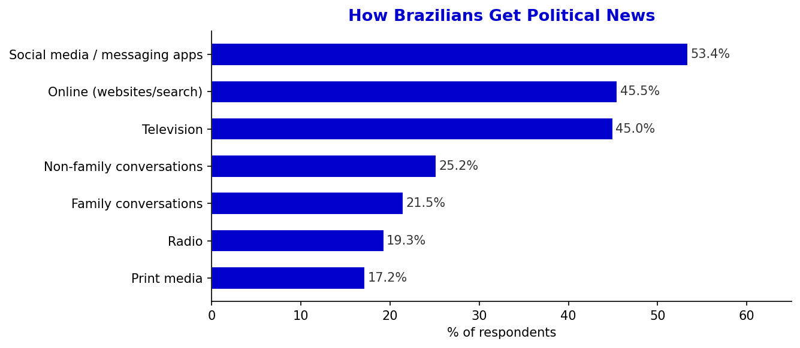
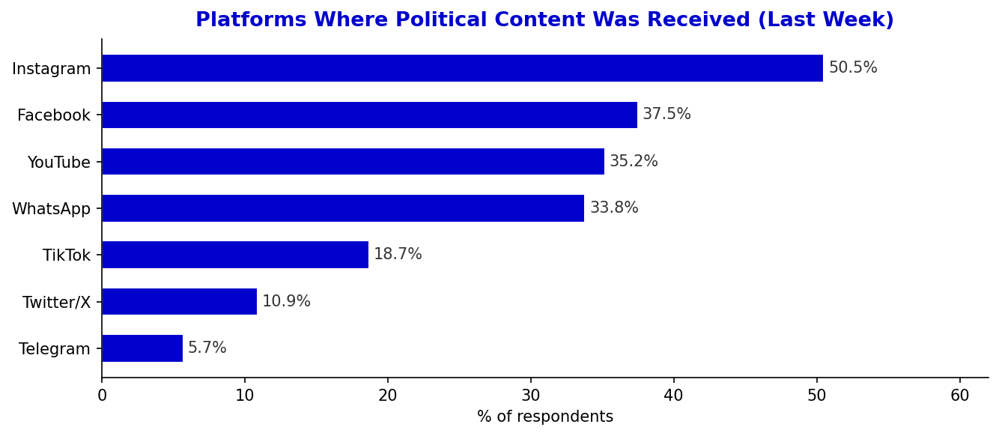
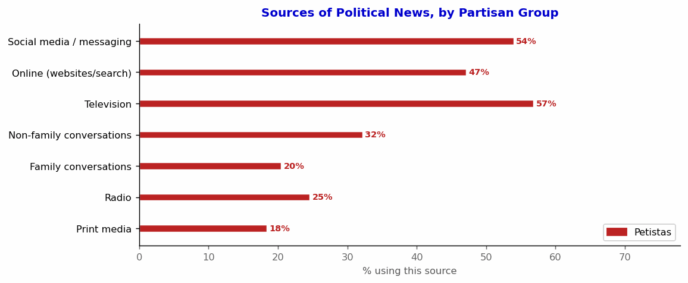
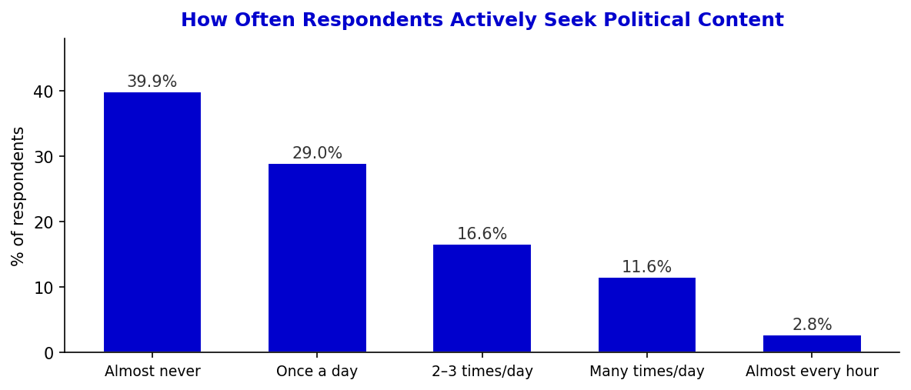
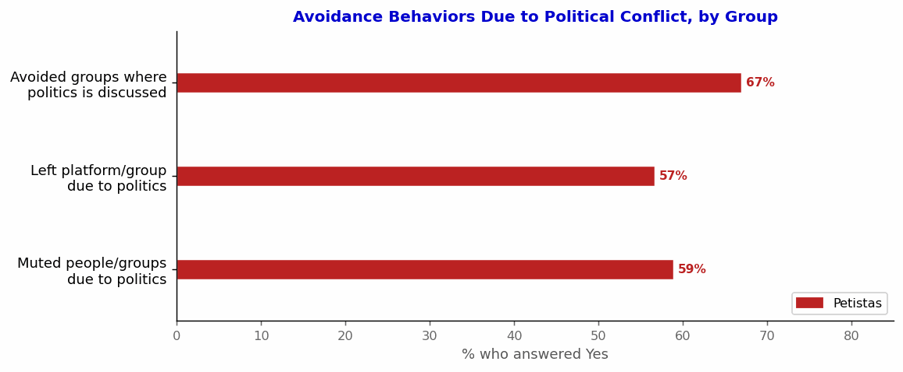
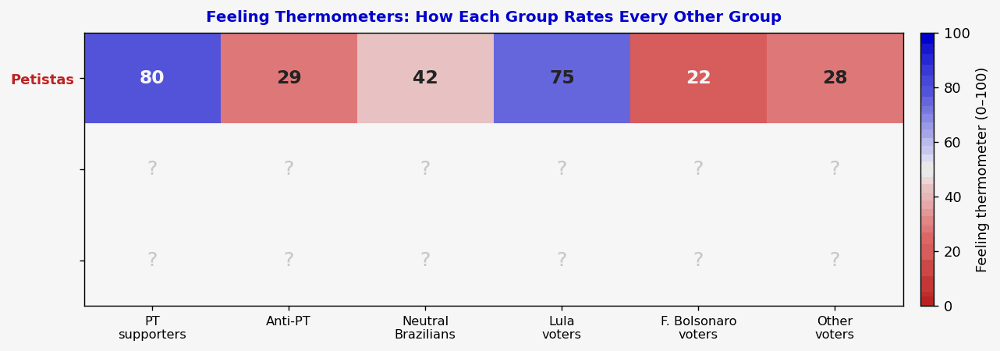
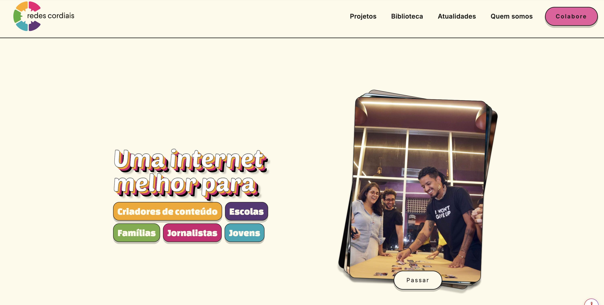

```{r setup, include=FALSE}
knitr::opts_chunk$set(echo = FALSE, warning = FALSE, message = FALSE)
```


# Motivation {background-color="#0000CD"}

## The Problem: Polarization in Contemporary Democracies

:::: {.columns}
::: {.column width="55%"}
::: {.incremental}
- Affective polarization has risen sharply across democracies — citizens increasingly **dislike** and **distrust** the other side
- Polarization **threatens institutions**: erodes electoral trust, weakens democratic norms, enables democratic backsliding
- Polarization **damages everyday life**: hostile interactions, family conflict, online aggression
- Brazil is a key case — one of the world's most polarized electorates after 2018
:::
:::
::: {.column width="42%"}
::: {.callout-note title="The Puzzle"}
People **might** be aware of polarization's costs — yet **behavioral change remains elusive**.

Can *framing* those costs trigger action?
:::
::: {.callout-warning title="Our Approach"}
Two parallel experiments targeting **both** the supply (elites) and demand (citizens) sides simultaneously.
:::
:::
::::

## Theoretical Framework

```{r dag, fig.height=3.4, fig.width=10}
library(ggplot2)
library(ggraph)
library(tidygraph)

nodes <- data.frame(
  name = c("Treatment\n(Risk Frame)",
           "Macro costs\nDemocratic · Economic",
           "Micro costs\nRelational · Social",
           "Institutional\nresponsibility",
           "Relational\nnorms",
           "↑ Behavioral\nengagement\n(citizens)"),
  x = c(0, 2, 2, 4, 4, 6),
  y = c(0, 0.8, -0.8, 0.8, -0.8, 0),
  type = c("treat","macro","micro","mech","mech","out")
)
edges <- data.frame(
  from = c(1,1,2,3,4,5),
  to   = c(2,3,4,5,6,6)
)
g <- tbl_graph(nodes=nodes, edges=edges)
ggraph(g, layout="manual", x=nodes$x, y=nodes$y) +
  geom_edge_link(arrow=arrow(length=unit(3,"mm"), type="closed"),
                 end_cap=circle(7,"mm"), color="#555555", width=0.8) +
  geom_node_label(aes(label=name, fill=type), size=3.0,
                  label.padding=unit(0.3,"lines"), color="white",
                  fontface="bold", label.r=unit(0.3,"lines")) +
  scale_fill_manual(values=c(treat="#0000CD", macro="#0064B4",
                              micro="#B43C00", mech="#666666",
                              out="#2A8A2A")) +
  annotate("text", x=2, y=1.45, label="RQ: which frame type has larger effects?",
           size=3, color="#444444", fontface="italic") +
  theme_void() + theme(legend.position="none") +
  coord_cartesian(ylim=c(-1.5,1.7))
```

::: {.fragment}
**Key insight:** behavioral change may occur *without* attitudinal depolarization (H7)
:::

## Study Timeline

{fig-align="center" width="96%"}

::: aside
Wave 1 data (May 2026) already collected (*N* ≈ 5,900). Shaded area = official campaign period. Treatment delivered during Waves 3–4 at peak campaign intensity; primary behavioral outcomes measured in Wave 5, two weeks before the first round.
:::

## Context: Brazil 2026

:::: {.columns}
::: {.column width="48%"}
**Why Brazil?**

- 2022 election produced record-high polarization between PT and anti-PT camps
- Presidential race ongoing: Lula vs. Flávio Bolsonaro likely second round
- WhatsApp is the primary arena for political conflict among ordinary citizens
- Redes Cordiais — established NGO working on online conflict de-escalation
:::
::: {.column width="48%"}
::: {.fragment}
**Why this moment?**

- Campaign period: elites actively calibrating rhetoric
- Citizens exposed to heavy political content
- Meta ad infrastructure enables direct elite targeting at scale
- 6-wave panel tracks behavioral decay over time
:::
:::
::::

---

# Baseline Data {background-color="#0000CD"}

## Is Brazil Heading in the Right Direction?

{fig-align="center" width="85%"}

::: aside
Same question, same country, same moment — completely different realities. [Petistas]{style="color:#BB2222; font-weight:bold"}: 84% right direction. [Antipetistas]{style="color:#0000CD; font-weight:bold"}: 83% wrong direction. Non-partisans are evenly split. This perceptual divide directly motivates the *macro* treatment frames.
:::

## Brazil's Biggest Problem Today

{fig-align="center" width="80%"}

::: {.fragment .fade-in}
::: aside
Weighted baseline survey, Wave 1, *N* ≈ 5,900. Economy includes unemployment, inflation, wages, inequality, taxes, growth. Security & Social includes violence, poverty, health, education, environment.
:::
:::

## Brazil's Biggest Problem: by Partisan Group

{fig-align="center" width="85%"}

::: aside
[Antipetistas]{style="color:#0000CD; font-weight:bold"} are over twice as likely to name **Corruption** (48% vs 23%). [Petistas]{style="color:#BB2222; font-weight:bold"} are four times more likely to name **Political Polarization** (12% vs 3%).
:::

## How Brazilians Get Political News

{fig-align="center" width="88%"}

::: {style="display:flex; gap:1.5em; margin-top:0.4em; font-size:0.82em"}
::: {.callout-note title="Key finding"}
**Social media and messaging apps** are the dominant source of political news (53%), surpassing television and online search.
:::
::: {.callout-tip title="Implication"}
WhatsApp groups are the primary arena for political conflict — making them the right target for citizen-level interventions.
:::
:::

## Platforms for Political Content

{fig-align="center" width="88%"}

::: {style="display:flex; gap:1.5em; margin-top:0.4em; font-size:0.82em"}
::: {.callout-note title="Key finding"}
**Instagram leads** (50.5%), followed by Facebook (37.5%) and WhatsApp (33.8%). Twitter/X (10.9%) and Telegram (5.7%) remain niche.
:::
::: {.callout-tip title="Design relevance"}
Instagram + Facebook coverage justifies Meta ad targeting for the **elite experiment**.
:::
:::

## Sources of Political News, by Partisan Group

{fig-align="center" width="85%"}

::: aside
[Petistas]{style="color:#BB2222; font-weight:bold"} rely more heavily on **television** (57% vs 38%). [Antipetistas]{style="color:#0000CD; font-weight:bold"} are the heaviest users of **social media** (64%) and **online** sources. Non-partisans show lower engagement across all channels.
:::

## Frequency of Active Political Content Seeking

{fig-align="center" width="72%"}

::: aside
Nearly 70% actively seek political content at least once a day. High political engagement → high treatment reachability.
:::

## Exposure to Online Political Conflict

{fig-align="center" width="78%"}

::: aside
Weighted baseline survey, Wave 1, *N* ≈ 5,900.
:::

## Exposure to Online Political Conflict, by Partisan Group

{fig-align="center" width="80%"}

::: aside
[Petistas]{style="color:#BB2222; font-weight:bold"} are most exposed: 87–90% experienced conflict online in the last month. [Non-partisans]{style="color:#888888; font-weight:bold"} are least exposed (72–78%), yet still a large majority — conflict reaches across the political spectrum.
:::

## More Exposure → More Avoidance

{fig-align="center" width="84%"}

::: aside
Among those frequently exposed to offensive political content, **muting** rises by +29 pp and **leaving groups** by +28 pp compared to those with no exposure. The most exposed respondents are also the most likely to disengage — the opposite of what an engaged citizenry requires.
:::

## Avoidance Behaviors Due to Political Conflict

{fig-align="center" width="72%"}

::: aside
Majorities have taken active steps to disengage from political conflict online. This avoidance — rather than engagement — is the default response our intervention aims to change.
:::

## Avoidance Behaviors by Partisan Group

{fig-align="center" width="82%"}

::: aside
[Petistas]{style="color:#BB2222; font-weight:bold"} = PT as favourite party · [Antipetistas]{style="color:#0000CD; font-weight:bold"} = PT as least favourite · [Non-partisans]{style="color:#888888; font-weight:bold"} = all others. Petistas show the highest avoidance rates across all three behaviors.
:::

## Feeling Thermometers: Full Matrix by Partisan Group

{fig-align="center" width="88%"}

::: aside
Each cell = mean thermometer score (0–100). [Petistas]{style="color:#BB2222; font-weight:bold"} rate PT/Lula high (75–80) and Anti-PT/FB voters very low (22). [Antipetistas]{style="color:#0000CD; font-weight:bold"} show the mirror pattern. Non-partisans rate all groups in the 27–40 range — cool but not hostile.
:::

## Affective Polarization: In-group vs. Out-group Thermometers

{fig-align="center" width="82%"}

::: aside
Petistas = PT as favourite party (*n* ≈ 1,374); Antipetistas = PT as least favourite (*n* ≈ 2,122); Non-partisans = all others. H7 tests whether behavioral change is possible *without* closing these gaps.
:::

---

# Survey Experiment Design {background-color="#0000CD"}

## Five-Wave Panel

```{r waves, fig.height=3.0, fig.width=12}
library(ggplot2)
waves <- data.frame(
  wave   = 1:5,
  label  = c("Wave 1","Wave 2","Wave 3","Wave 4","Wave 5"),
  timing = c("May – Jun","Jun – Jul","July","August","Sep – Oct"),
  desc   = c("Baseline","No-treatment\ncheck","Video 1\n(no outcome)",
             "Video 2\n+ Outcomes","Decay"),
  note   = c("Polarization\nbaseline\nN ≈ 5,000",
             "Does polarization\nor priorities shift\nwithout treatment?",
             "Randomized\nby partisan\nblock",
             "Primary\nbehavioral\noutcome",
             "Persistence\nof effects")
)
ggplot(waves) +
  geom_tile(aes(x=wave, y=0.5), width=0.85, height=0.75,
            fill="#0000CD", color="white", linewidth=0.8) +
  geom_text(aes(x=wave, y=0.78, label=label), color="white",
            fontface="bold", size=3.6) +
  geom_text(aes(x=wave, y=0.55, label=timing), color="#cce0ff", size=2.6) +
  geom_text(aes(x=wave, y=0.27, label=desc), color="white", size=2.5) +
  geom_text(aes(x=wave, y=-0.22, label=note), color="#555555",
            size=2.3, lineheight=0.9) +
  geom_segment(data=data.frame(x=1:4+0.43, xend=1:4+0.57),
               aes(x=x, xend=xend, y=0.5, yend=0.5),
               arrow=arrow(length=unit(2.5,"mm"), type="closed"),
               color="#0000CD", linewidth=0.8) +
  scale_x_continuous(limits=c(0.4,5.6)) +
  scale_y_continuous(limits=c(-0.9,1.15)) +
  theme_void() +
  theme(plot.margin=margin(0,0,0,0))
```

::: {style="font-size:0.85em; margin-top:0.5em"}
**Randomization:** block-randomized by partisan group (PT supporters / Anti-PT / Neutral) · **Retention incentive:** lottery of 3 prizes for panelists completing all waves
:::

## Treatment Arms: Four Informational Frames

:::: {.columns}
::: {.column width="48%"}
::: {.callout-note title="🏛️ Macro Frames"}
**Democratic Deterioration**
Polarization undermines electoral trust, weakens institutions, reduces acceptance of outcomes.

**Economic Deterioration**
Polarization increases uncertainty, discourages investment, generates gridlock, slows growth.
:::
:::
::: {.column width="48%"}
::: {.callout-warning title="👨‍👩‍👧 Micro Frames"}
**Social Conflict**
Polarization increases everyday hostility, normalizes aggression, reduces social trust.

**Family Conflict**
Polarization damages family relationships, causes estrangement and lasting relational harm.
:::
:::
::::

| | |
|---|---|
| **Control** | No informational frame; outcome measurement only |

::: aside
Identical content across survey and field experiments.
:::

## Treatment Video — Democratic Deterioration {background-color="#111111"}

::: {style="display:flex; justify-content:center; align-items:center; height:70%; color:white; font-size:1.4em; font-weight:bold; flex-direction:column; gap:1em"}
▶

Democratic Deterioration — Treatment Video

::: {style="font-size:0.6em; color:#aaaaaa"}
[Video coming soon]
:::
:::

## Treatment Video — Economic Deterioration {background-color="#111111"}

::: {style="display:flex; justify-content:center; align-items:center; height:70%; color:white; font-size:1.4em; font-weight:bold; flex-direction:column; gap:1em"}
▶

Economic Deterioration — Treatment Video

::: {style="font-size:0.6em; color:#aaaaaa"}
[Video coming soon]
:::
:::

## Treatment Video — Social Conflict {background-color="#111111"}

```{=html}
<div style="display:flex; justify-content:center; align-items:center; height:80%">
  <iframe width="960" height="540"
    src="https://www.youtube.com/embed/bUX8ewmBA60"
    frameborder="0"
    allow="accelerometer; autoplay; clipboard-write; encrypted-media; gyroscope; picture-in-picture; web-share"
    allowfullscreen>
  </iframe>
</div>
```

## Treatment Video — Family Conflict {background-color="#111111"}

```{=html}
<div style="display:flex; justify-content:center; align-items:center; height:80%">
  <iframe width="960" height="540"
    src="https://www.youtube.com/embed/d1Q-mwkFoHQ"
    frameborder="0"
    allow="accelerometer; autoplay; clipboard-write; encrypted-media; gyroscope; picture-in-picture; web-share"
    allowfullscreen>
  </iframe>
</div>
```

## Primary Behavioral Outcomes

:::: {.columns}
::: {.column width="48%"}
::: {.callout-note title="Primary: Seminar Enrollment"}
After treatment, respondents are offered free enrollment in a **1-hour online seminar** organized by *Redes Cordiais*:

- Practical strategies for polarizing content
- Responding to misinformation

**Enrollment click = primary outcome**
:::
:::
::: {.column width="48%"}
::: {.callout-tip title="Secondary: Manual Download"}
Respondents are offered a downloadable **practical manual** with tips for managing political conflict in WhatsApp groups.

Download click = secondary behavioral outcome.
:::
::: {.callout-note title="Why behavioral?"}
Both outcomes require active choice, not just stated willingness. Low cost & low social desirability bias.
:::
:::
::::

## Secondary Outcomes and Mechanisms {.smaller}

:::: {.columns}
::: {.column width="48%"}
**Secondary outcomes (voters)**

- Stated willingness to intervene in WhatsApp conflicts
- Self-reported corrective behavior (subsequent waves)
- Support for democratic norms / election acceptance

**Mechanisms**

- Perceived costs of polarization (macro / micro index)
- Perceived efficacy of intervention
- Perceived social cost of speaking up
:::
::: {.column width="48%"}
**Placebo / "Should not move"**

- Partisan compromise attitudes
- Anti-democratic norm trade-offs (e.g., bypassing courts)
- Affective polarization thermometers

::: {.callout-warning title="H7 test"}
If behavioral outcomes move *without* thermometers moving, we confirm action ≠ attitude change.
:::
:::
::::

## Power Analysis

{fig-align="center" width="92%"}

::: aside
Monte Carlo simulation (4,000 draws per cell) · **3-arm design**: Control, Macro, Micro — equal allocation within partisan blocks · Pooled treatment vs. control · [Petistas]{style="color:#BB2222; font-weight:bold"} & [Non-partisans]{style="color:#888888; font-weight:bold"} receive the full group effect; [Antipetistas]{style="color:#0000CD; font-weight:bold"} receive no effect · Assumed baseline rates: manual download = 15%, seminar enrollment = 8% · ★ ≥ 80% power · ★★ ≥ 90% power
:::

---

## Expected Results — Concern about Polarization {background-color="#ffffff"}

{fig-align="center" width="86%"}

::: aside
Simulated data for illustration · Treatment group shows increased concern about polarization from Wave 3 onwards · Control group remains stable around baseline · Effect consolidates at Wave 4 and persists through Wave 5
:::


---

# Hypotheses {background-color="#0000CD"}

## Pre-Registered Hypotheses {.smaller}

| | |
|:--|:---|
| **H1** | **Manipulation check:** Each treatment increases perceived costs in its corresponding domain (macro vs. micro) |
| **H2** | Any treatment **increases behavioral engagement** among voters vs. control |
| **H3** | [Macro frames]{style="color:#0064B4; font-weight:bold"} increase behavioral engagement vs. **control** |
| **H4** | [Micro frames]{style="color:#B43C00; font-weight:bold"} increase behavioral engagement vs. **control** |
| **H5** | Effects are **mediated** by increased perceived costs and perceived efficacy |
| **H6** | Behavioral effects may occur **without** changes in affective polarization |

::: {.callout-note title="Research Question"}
Which type of message — macro (democratic/economic) or micro (social/family) — produces larger behavioral effects among voters?
:::


---

# Field Experiment {background-color="#0000CD"}

## Targeting Political Elites {.smaller}

:::: {.columns}
::: {.column width="52%"}
**Population & Scale**

- Almost 30,000 candidates for Federal and State Deputy
- Identified via official electoral records (TSE)
- Verified public Meta accounts (Facebook & Instagram)
- **Over 25,000 candidate emails** extracted from official records

**Delivery**

1. Paid Meta advertisements in candidates' own social media environments
2. Direct email campaign with treatment videos
3. Individual-level randomization across 5 arms
:::
::: {.column width="44%"}
::: {.callout-note title="Outcome Measurement"}
**Polarizing rhetoric** in public posts during campaign period via **supervised text classification**:

- Delegitimizing opponents
- Framing rivals as threats
- Inflammatory language
:::
::: {.callout-tip title="Secondary"}
Depolarizing cues (civility, bridge-building) and democratic norm compliance
:::
:::
::::

## Partnership with Redes Cordiais

:::: {.columns}
::: {.column width="35%"}
{width="100%"}
:::
::: {.column width="62%"}
**Who they are**

- Leading Brazilian NGO focused on online conflict de-escalation
- Experience training citizens to respond to polarizing content
- Recognized credibility across political groups

**Role in the study**

- Co-host of the 1-hour intervention seminar (primary behavioral outcome)
- Provide the practical manual for WhatsApp conflict
- Lend legitimacy to the intervention materials
:::
::::

## Partnership with Redes Cordiais (cont.)

:::: {.columns}
::: {.column width="35%"}
{width="100%"}
:::
::: {.column width="62%"}
::: {.callout-note title="Why this partnership matters"}
The behavioral outcome is not hypothetical — enrollment links to a **real, existing program**. This eliminates demand effects and ensures real-world impact beyond the experiment.
:::
::: {.callout-warning title="Agreement status"}
Formal agreement with Redes Cordiais in place for seminar delivery and content collaboration.
:::
:::
::::

## Showing Voters Dislike Polarization

:::: {.columns}
::: {.column width="52%"}
**The mechanism for elites**

- Candidates face electoral incentives
- Treatment reveals a **credible signal**: voters are concerned about polarization's costs
- Provides reputational & governance rationale to moderate rhetoric

**Campaign channels**

1. Instagram & Facebook paid ads (Meta targeting)
2. Direct email to 25,000+ candidate emails
3. Content mirrors the four informational frames
:::
::: {.column width="44%"}
::: {.callout-note title="Key message to elites"}
"Brazilian voters across the spectrum are concerned about how polarization harms [democracy / the economy / families / communities]. Your rhetoric affects these outcomes."
:::
::: {.callout-tip title="Identification advantage"}
Simultaneous elite + citizen intervention allows testing whether **supply and demand changes reinforce each other**.
:::
:::
::::

---

# Summary {background-color="#0000CD"}

## Summary {.smaller}

:::: {.columns}
::: {.column width="48%"}
**What we are doing**

1. 6-wave panel survey experiment with *N* ≈ 5,000 Brazilian voters
2. Field experiment with ~20,000 candidates for Federal and State Deputy
3. Four informational frames (macro: democratic, economic; micro: social, family)
4. Behavioral primary outcomes (seminar enrollment, manual download)
:::
::: {.column width="48%"}
**Why it matters**

- Tests whether *framing* polarization costs is enough to trigger action — without requiring attitude change
- First study to intervene simultaneously on both elites and citizens using identical frames
- Real-world partnership with Redes Cordiais ensures external validity
- Results speak to the possibility of **behavioral depolarization** even in highly divided polities
:::
::::

::: {.callout-tip title="Core contribution" style="margin-top:1em"}
Concern about polarization is widespread. AWARE tests whether it can be converted into action.
:::
