```{r setup, include=FALSE}
knitr::opts_chunk$set(echo = FALSE, warning = FALSE, message = FALSE)
```


# Motivation {background-color="#0000CD"}

## The Problem: Polarization in Contemporary Democracies

:::: {.columns}
::: {.column width="55%"}
::: {.incremental}
- Affective polarization has risen sharply across democracies — citizens increasingly **dislike** and **distrust** the other side
- Polarization **threatens institutions**: erodes electoral trust, weakens democratic norms, enables democratic backsliding
- Polarization **damages everyday life**: hostile interactions, family conflict, online aggression
- Brazil is a key case — one of the world's most polarized electorates after 2018
:::
:::
::: {.column width="42%"}
::: {.fragment}
::: {.callout-note title="The Puzzle"}
People **might** be aware of polarization's costs — yet **behavioral change remains elusive**.

Can *spelling out* those costs trigger action?
:::
:::
::: {.fragment}
::: {.callout-warning title="Our Approach"}
Panel with **~6,000 voters** embedding experiments using professional videos
:::
:::
:::
::::

## Context: Brazil 2026

:::: {.columns}
::: {.column width="48%"}
**Why Brazil?**

- 2022 election produced record-high polarization between PT and anti-PT camps
- Presidential race ongoing: Lula vs. Flávio Bolsonaro likely second round
- WhatsApp is the primary arena for political conflict among ordinary citizens
- Redes Cordiais — established NGO working on online conflict de-escalation
:::
::: {.column width="48%"}
::: {.fragment}
**Why this moment?**

- Campaign period: positive and negative partisanship very activated
- Citizens exposed to heavy political content
- Still around 1/3 of non-partisans in the country
- 5-wave panel tracks possible effects over time
:::
:::
::::

## Context: Brazil 2026

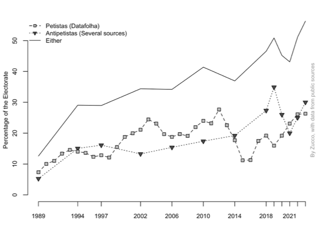{fig-align="center" width="90%"}

## Experimental Design

```{r arms, fig.height=3.2, fig.width=11}
library(ggplot2)

arms <- data.frame(
  x      = c(1, 3, 5),
  label  = c("Treatment 1", "Treatment 2", "Control"),
  sub1   = c("Macro Costs", "Micro Costs", ""),
  sub2   = c("Democratic · Economic", "Relational · Social", "Nature / museums\n(similar length)"),
  fill   = c("#0064B4", "#B43C00", "#555555")
)

ggplot(arms) +
  geom_rect(aes(xmin = x - 0.80, xmax = x + 0.80,
                ymin = 0.05,     ymax = 0.95,
                fill = fill), color = "white", linewidth = 1.2) +
  scale_fill_identity() +
  geom_text(aes(x = x, y = 0.80, label = label),
            color = "white", fontface = "bold", size = 5.2) +
  geom_text(aes(x = x, y = 0.57, label = sub1),
            color = "white", fontface = "bold", size = 4.2) +
  geom_text(aes(x = x, y = 0.34, label = sub2),
            color = "#dddddd", size = 3.5, lineheight = 0.95) +
  annotate("text", x = 3, y = 1.10,
           label = "RQ: which frame type produces larger behavioral effects?",
           size = 3.8, color = "#333333", fontface = "italic") +
  scale_x_continuous(limits = c(0, 6)) +
  scale_y_continuous(limits = c(0, 1.2)) +
  theme_void() +
  theme(plot.margin = margin(5, 5, 5, 5))
```

::: {.fragment}
**Key insight:** behavioral change may occur *without* attitudinal depolarization
:::

## Study Timeline

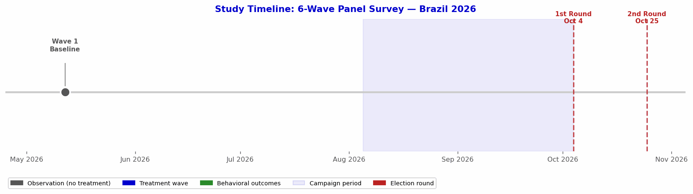{fig-align="center" width="96%"}

::: aside
Wave 1 data (May 2026) already collected (*N* ≈ 5,900). Shaded area = official campaign period. Treatment delivered during Waves 3–4 at peak campaign intensity; primary behavioral outcomes measured in Wave 5, two weeks before the first round.
:::

---

# Baseline Data {background-color="#0000CD"}

## Is Brazil Heading in the Right Direction?

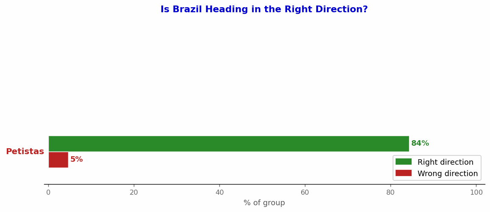{fig-align="center" width="85%"}

::: aside
Same question, same country, same moment — completely different realities. [Petistas]{style="color:#BB2222; font-weight:bold"}: 84% right direction. [Antipetistas]{style="color:#0000CD; font-weight:bold"}: 83% wrong direction. Non-partisans are evenly split. This perceptual divide directly motivates the *macro* treatment frames.
:::

## Brazil's Biggest Problem Today

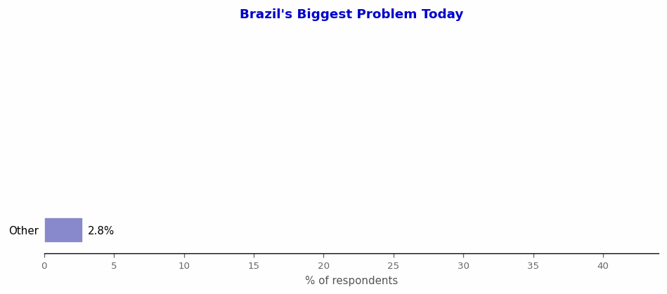{fig-align="center" width="80%"}

::: {.fragment .fade-in}
::: aside
Weighted baseline survey, Wave 1, *N* ≈ 5,900. Economy includes unemployment, inflation, wages, inequality, taxes, growth. Security & Social includes violence, poverty, health, education, environment.
:::
:::

## Brazil's Biggest Problem: by Partisan Group

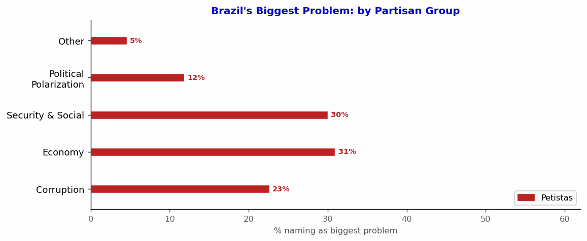{fig-align="center" width="85%"}

::: aside
[Antipetistas]{style="color:#0000CD; font-weight:bold"} are over twice as likely to name **Corruption** (48% vs 23%). [Petistas]{style="color:#BB2222; font-weight:bold"} are four times more likely to name **Political Polarization** (12% vs 3%).
:::


## Exposure to Online Political Conflict

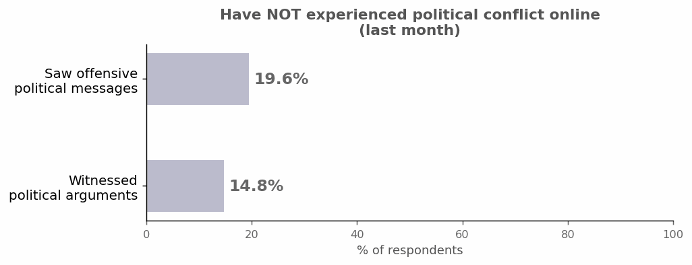{fig-align="center" width="78%"}

::: aside
Weighted baseline survey, Wave 1, *N* ≈ 5,900.
:::

## Exposure to Online Political Conflict, by Partisan Group

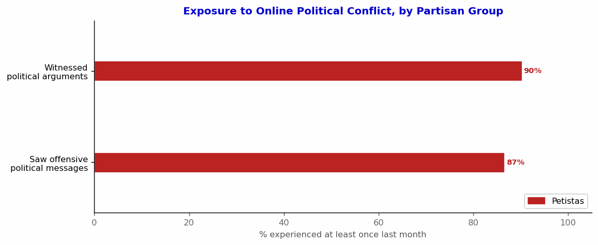{fig-align="center" width="80%"}

::: aside
[Petistas]{style="color:#BB2222; font-weight:bold"} are most exposed: 87–90% experienced conflict online in the last month. [Non-partisans]{style="color:#888888; font-weight:bold"} are least exposed (72–78%), yet still a large majority — conflict reaches across the political spectrum.
:::

## More Exposure → More Avoidance

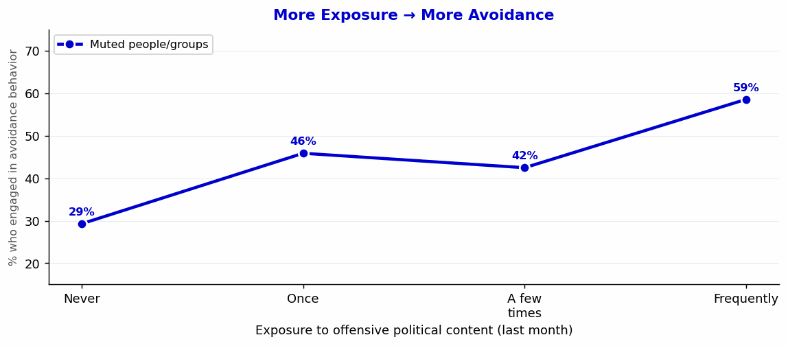{fig-align="center" width="84%"}

::: aside
Among those frequently exposed to offensive political content, **muting** rises by +29 pp and **leaving groups** by +28 pp compared to those with no exposure. The most exposed respondents are also the most likely to disengage — the opposite of what an engaged citizenry requires.
:::

## Avoidance Behaviors Due to Political Conflict

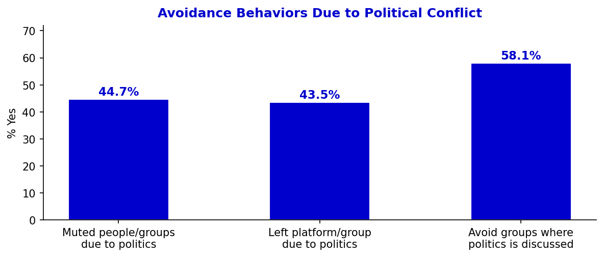{fig-align="center" width="72%"}

::: aside
Majorities have taken active steps to disengage from political conflict online. This avoidance — rather than engagement — is the default response our intervention aims to change.
:::


## Affective Polarization: In-group vs. Out-group Thermometers

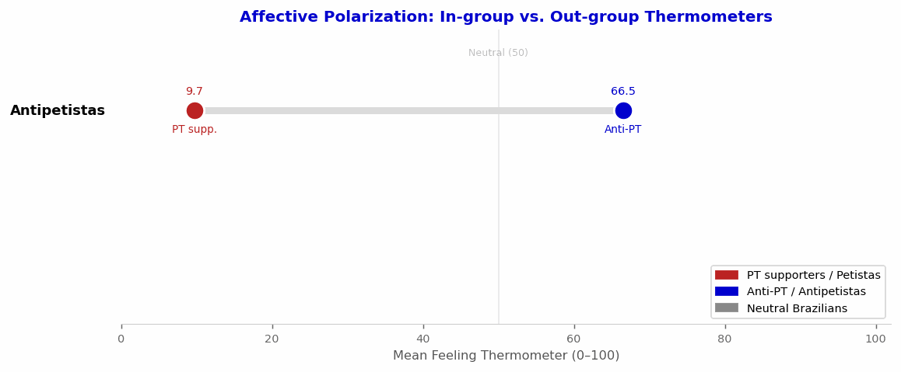{fig-align="center" width="82%"}

::: aside
Petistas = PT as favourite party (*n* ≈ 1,374); Antipetistas = PT as least favourite (*n* ≈ 2,122); Non-partisans = all others. H7 tests whether behavioral change is possible *without* closing these gaps.
:::

---

# Survey Experiment Design {background-color="#0000CD"}

## Five-Wave Panel

```{r waves, fig.height=3.0, fig.width=12}
library(ggplot2)
waves <- data.frame(
  wave   = 1:5,
  label  = c("Wave 1","Wave 2","Wave 3","Wave 4","Wave 5"),
  timing = c("May – Jun","Jun – Jul","July","August","Sep – Oct"),
  desc   = c("Baseline","No-treatment\ncheck","Video 1\n(no outcome)",
             "Video 2\n+ Outcomes","Decay"),
  note   = c("Polarization\nbaseline\nN ≈ 6,000",
             "Does polarization\nor priorities shift\nwithout treatment?",
             "Randomized\nby partisan\nblock",
             "Primary\nbehavioral\noutcome",
             "Persistence\nof effects")
)
ggplot(waves) +
  geom_tile(aes(x=wave, y=0.5), width=0.85, height=0.75,
            fill="#0000CD", color="white", linewidth=0.8) +
  geom_text(aes(x=wave, y=0.78, label=label), color="white",
            fontface="bold", size=3.6) +
  geom_text(aes(x=wave, y=0.55, label=timing), color="#cce0ff", size=2.6) +
  geom_text(aes(x=wave, y=0.27, label=desc), color="white", size=2.5) +
  geom_text(aes(x=wave, y=-0.22, label=note), color="#555555",
            size=2.3, lineheight=0.9) +
  geom_segment(data=data.frame(x=1:4+0.43, xend=1:4+0.57),
               aes(x=x, xend=xend, y=0.5, yend=0.5),
               arrow=arrow(length=unit(2.5,"mm"), type="closed"),
               color="#0000CD", linewidth=0.8) +
  scale_x_continuous(limits=c(0.4,5.6)) +
  scale_y_continuous(limits=c(-0.9,1.15)) +
  theme_void() +
  theme(plot.margin=margin(0,0,0,0))
```

::: {style="font-size:0.85em; margin-top:0.5em"}
**Randomization:** block-randomized by partisan group (PT supporters / Anti-PT / Neutral) · **Retention incentive:** lottery of 3 prizes for panelists completing all waves
:::

## Treatment Arms: Four Informational Frames

:::: {.columns}
::: {.column width="48%"}
::: {.callout-note title="🏛️ Macro Frames"}
**Democratic Deterioration**
Polarization undermines electoral trust, weakens institutions, reduces acceptance of outcomes.

**Economic Deterioration**
Polarization increases uncertainty, discourages investment, generates gridlock, slows growth.
:::
:::
::: {.column width="48%"}
::: {.callout-warning title="👨‍👩‍👧 Micro Frames"}
**Social Conflict**
Polarization increases everyday hostility, normalizes aggression, reduces social trust.

**Family Conflict**
Polarization damages family relationships, causes estrangement and lasting relational harm.
:::
:::
::::

| | |
|---|---|
| **Control** | Apolitical video of similar length (nature, museums) |

::: aside
Identical content across survey and field experiments.
:::

## Primary Behavioral Outcomes

:::: {.columns}
::: {.column width="48%"}
::: {.callout-note title="Primary: Seminar Enrollment"}
After treatment, respondents are offered free enrollment in a **1-hour online seminar** organized by *Redes Cordiais*:

- Practical strategies for polarizing content
- Responding to misinformation

**Enrollment click = primary outcome**
:::
:::
::: {.column width="48%"}
::: {.callout-tip title="Secondary: Manual Download"}
Respondents are offered a downloadable **practical manual** with tips for managing political conflict in WhatsApp groups.

Download click = secondary behavioral outcome.
:::
::: {.callout-note title="Why behavioral?"}
Both outcomes require active choice, not just stated willingness. Low cost & low social desirability bias.
:::
:::
::::

## Secondary Outcomes and Mechanisms {.smaller}

:::: {.columns}
::: {.column width="48%"}
**Secondary outcomes (voters)**

- Stated willingness to intervene in WhatsApp conflicts
- Self-reported corrective behavior (subsequent waves)
- Support for democratic norms / election acceptance

**Mechanisms**

- Perceived costs of polarization (macro / micro index)
- Perceived efficacy of intervention
- Perceived social cost of speaking up
:::
::: {.column width="48%"}
**Placebo / "Should not move"**

- Partisan compromise attitudes
- Anti-democratic norm trade-offs (e.g., bypassing courts)
- Affective polarization thermometers

::: {.callout-warning title="H7 test"}
If behavioral outcomes move *without* thermometers moving, we confirm action ≠ attitude change.
:::
:::
::::

## Power Analysis

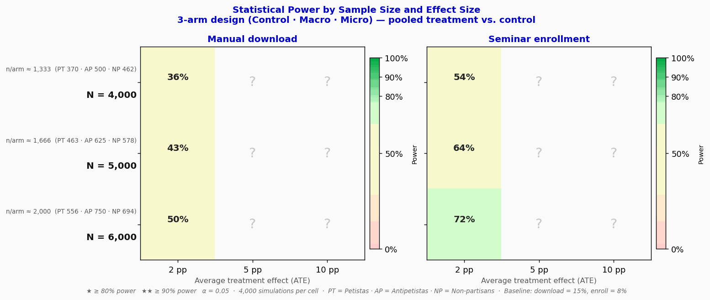{fig-align="center" width="92%"}

::: aside
Monte Carlo simulation (4,000 draws per cell) · **3-arm design**: Control, Macro, Micro — equal allocation within partisan blocks · Pooled treatment vs. control · [Petistas]{style="color:#BB2222; font-weight:bold"} & [Non-partisans]{style="color:#888888; font-weight:bold"} receive the full group effect; [Antipetistas]{style="color:#0000CD; font-weight:bold"} receive no effect · Assumed baseline rates: manual download = 15%, seminar enrollment = 8% · ★ ≥ 80% power · ★★ ≥ 90% power
:::

---

## Expected Results — Concern about Polarization {background-color="#ffffff"}

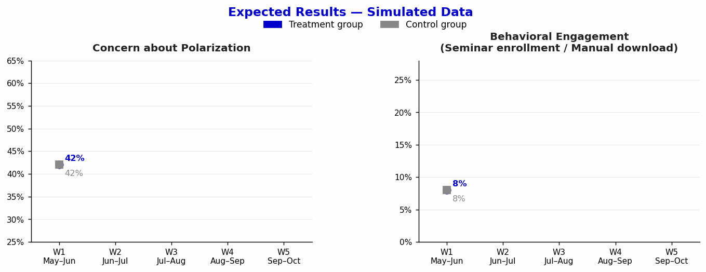{fig-align="center" width="70%"}

::: aside
Simulated data for illustration · Treatment group shows increased concern about polarization from Wave 3 onwards · Control group remains stable around baseline · Effect consolidates at Wave 4 and persists through Wave 5
:::


---

# Hypotheses {background-color="#0000CD"}

## Pre-Registered Hypotheses {.smaller}

| | |
|:--|:---|
| **H1** | **Manipulation check:** Each treatment increases perceived costs in its corresponding domain (macro vs. micro) |
| **H2** | Any treatment **increases behavioral engagement** among voters vs. control |
| **H3** | [Macro frames]{style="color:#0064B4; font-weight:bold"} increase behavioral engagement vs. **control** |
| **H4** | [Micro frames]{style="color:#B43C00; font-weight:bold"} increase behavioral engagement vs. **control** |
| **H5** | Effects are **mediated** by increased perceived costs and perceived efficacy |
| **H6** | Behavioral effects may occur **without** changes in affective polarization |

::: {.callout-note title="Research Question"}
Which type of message — macro (democratic/economic) or micro (social/family) — produces larger behavioral effects among voters?
:::


---

# Summary {background-color="#0000CD"}

## Summary {.smaller}

:::: {.columns}
::: {.column width="48%"}
**What we are doing**

1. 5-wave panel survey experiment with *N* ≈ 6,000 Brazilian voters
2. Four informational frames (macro: democratic, economic; micro: social, family)
3. Behavioral primary outcomes (seminar enrollment, manual download)
4. Block-randomized by partisan group across three arms (Control, Macro, Micro)
:::
::: {.column width="48%"}
**Why it matters**

- Tests whether *framing* polarization costs is enough to trigger action — without requiring attitude change
- Behavioral outcomes require active choice — low social desirability bias
- Real-world partnership with *Redes Cordiais* ensures external validity
- Results speak to the possibility of **behavioral depolarization** even in highly divided polities
:::
::::

::: {.callout-tip title="Core contribution" style="margin-top:1em"}
Concern about polarization is widespread. AWARE tests whether it can be converted into action.
:::

---

## Treatment Video — Family Conflict {background-color="#111111"}

```{=html}
<div style="display:flex; justify-content:center; align-items:center; height:80%">
  <iframe width="960" height="540"
    src="https://www.youtube.com/embed/d1Q-mwkFoHQ"
    frameborder="0"
    allow="accelerometer; autoplay; clipboard-write; encrypted-media; gyroscope; picture-in-picture; web-share"
    allowfullscreen>
  </iframe>
</div>
```
